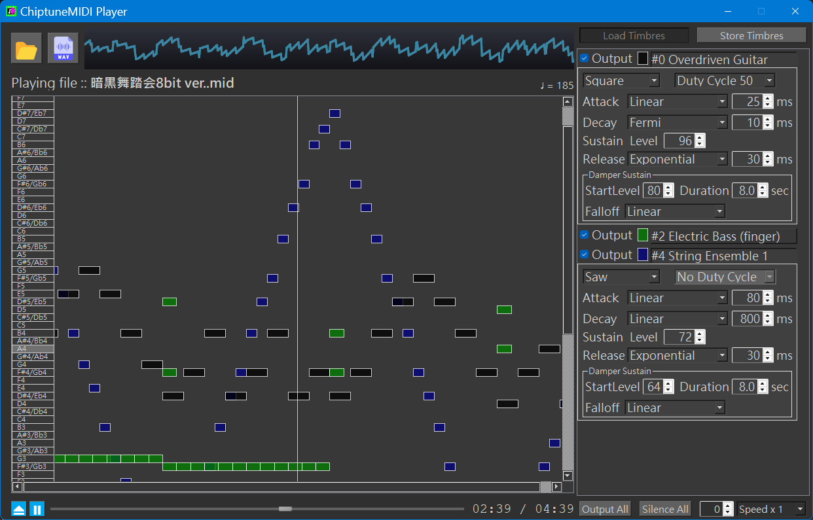
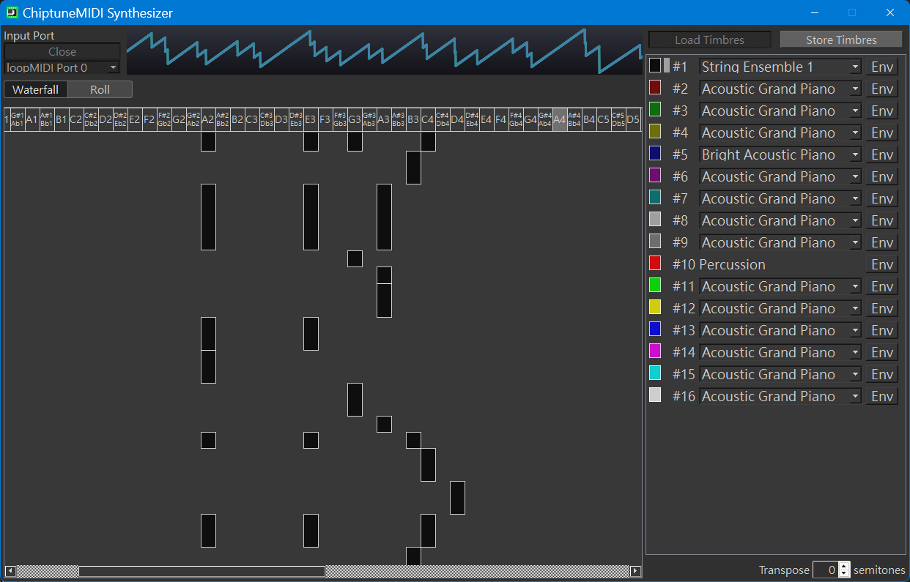

#   ChiptuneMIDI

## Description
<!--- Short introduction of the project. -->
ChiptuneMIDI is a chiptune engine that interprets MIDI messages as retro 8-bit-style sound, with pull and push modes for playback and live input, respectively.  
It also provides Qt front-ends for MIDI file playback and live MIDI input, plus a Qt-based library for simple MIDI-message-driven sound output.

## Demo
- [梁靜茹 如果有一天 — ChiptuneMIDI cover](https://www.youtube.com/watch?v=3lz47rfHsxA)  
  *(Generated with ChiptuneMIDI engine — [original song](https://www.youtube.com/watch?v=K3o6SfwZq_w) by 梁靜茹)*

## Features
<!--- Key features. -->

### Engine (Core Library)
- Pure C99, no external dependencies
- Supports both pull and push MIDI processing modes
  - Pull mode is used for MIDI file playback with accurate event time alignment
  - Push mode is used for live MIDI input where messages are delivered in real time
- Stereo/mono output at configurable sampling rates
- Retro waveforms (square with multiple duty cycles, triangle, saw, noise)
- Customizable ADSR envelopes with various curve types
- Supports common MIDI effects (e.g., vibrato, reverb, chords)
- Tempo control, pitch shift, and playback speed adjustable
- Exports audio samples (8-bit/16-bit) for any backend

### Applications (Qt GUI)
Both Qt GUI applications can configure waveforms, ADSR envelopes, and melodic channel timbres, and can load/store melodic channel timbres through `instrument_timbres.ini`.

#### ChiptuneMIDI Player



- Plays MIDI files directly with retro 8-bit sound
- Shows a score-like visual note sequencer for loaded MIDI files
- Exports audio output as `.wav`

#### ChiptuneMIDI Synthesizer



- Plays live MIDI input from an external MIDI controller with retro 8-bit sound
- Shows live notes with waterfall and roll sequencer modes

### Convenience Qt MIDI Output Library
- ChiptuneMIDI MidiOut
  - Plays chiptune audio by simply feeding MIDI messages through `SendMidiMessage()`
  - Includes a console example that streams MIDI file events into `ChiptuneMidiOut`


## Requirements / Dependencies
<!--- List of software, libraries, or frameworks required. -->

- C++11 compiler
- Qt 5.x (Core, Widgets, Charts, Multimedia; on Windows: WinExtras)
- Qt 6.x (Core, Widgets, Charts, Multimedia)
- CMake ≥ 3.20 (recommended), or QtCreator with qmake

## Installation
<!--- Steps to install and build. -->
Clone the repository **with submodules**:

```sh
git clone --recursive https://github.com/ChenGaiger/ChiptuneMIDI.git
```

If the repository was already cloned without submodules, initialize them manually:

```sh
git submodule update --init --recursive
```

**Warning:** GitHub's source `.zip` download does not include submodules.

You can build the Qt applications in two ways:

### Option A: CMake (Qt5 or Qt6)
1. Open one of these projects with QtCreator or run CMake manually:
   - `qt/player/CMakeLists.txt`
   - `qt/synthesizer/CMakeLists.txt`
2. Select a Qt kit (Qt5 or Qt6)
3. Build and run

### Option B: qmake (Qt5 only)
1. Open one of these projects in QtCreator:
   - `qt/player/qt5_qmake_project/ChiptuneMIDI.pro`
   - `qt/synthesizer/qt5_qmake_project/ChiptuneMIDI.pro`
2. Build and run

## Usage
<!--- Examples of how to run or use the project. -->

### Player
- Open a `.mid` file either by:
  - Dragging the file into the window, or
  - Clicking the **Open MIDI File** button and selecting from the file explorer.
- Playback starts automatically.
- To export audio, click the **Save as .wav File** button.

**Note:** A sample MIDI file (`qt/暗黒舞踏会8bit ver..mid`) is included for quick testing. Additional MIDI test files can be downloaded as [`midi_files.zip`](https://drive.google.com/uc?export=download&id=19hkeXNSYX80RGQMtTQ6RaFjBnu4ZCKod).

### Synthesizer
- Choose a MIDI input source first:
  - Physical MIDI controller: connect a MIDI keyboard or other controller to the computer, usually through USB. For example, a Casio keyboard may appear as `CASIO USB-MIDI 0`.
  - MIDI from another application: install a virtual MIDI loopback driver, such as [loopMIDI](https://www.tobias-erichsen.de/software/loopmidi.html), and create or use a virtual port such as the default `loopMIDI Port`. Applications such as [TuxGuitar](https://www.tuxguitar.app/) or [VMPK](https://vmpk.sourceforge.io/) can act as MIDI message providers by sending their MIDI output to that virtual port.
- Select the MIDI input port from the input port combo box.
- Click **Open** to route incoming MIDI messages into the chiptune engine, produce chiptune audio in real time, and show live notes in the sequencer.
- Use the channel timbre controls to adjust melodic channel waveforms and envelopes.
- Use the sequencer Waterfall/Roll buttons to switch the live note visualization mode.

**Note:** On some Windows systems, a newly created loopMIDI port may not appear until the Windows MIDI Service is restarted, even if it is already visible in the loopMIDI GUI. Open **Task Manager > Services**, restart **midisrv (Windows MIDI Service)**, then open **ChiptuneMIDI Synthesizer** and the application that provides MIDI messages.

### MidiOut Console Example
Unix-like shells:

```sh
./ChiptuneMidiOut <file.mid>
```

Windows:

```bat
ChiptuneMidiOut.exe <file.mid>
```

The example streams MIDI file events into `ChiptuneMidiOut::SendMidiMessage()`.

**Note:** On Windows, Qt Creator's **Build & Run > Run > Command line arguments** field may fail to pass file paths containing characters that the current system locale does not fully support. For example, `暗黒舞踏会8bit ver..mid` may fail on a Traditional Chinese system because `会` is not supported by that locale. Run the built executable directly, or use a MIDI file name fully supported by the local system locale.

## Project Structure
<!--- Overview of folders and files. -->
```text
ChiptuneMIDI/
├─ (root) # Core chiptune engine in portable C99
├─ mid_reader/ # MIDI parsing module
│ └─ qt/ # Qt integration layer
└─ qt/ # Qt application and library front-ends
  ├─ player/ # Qt MIDI player application
  ├─ synthesizer/ # Qt live MIDI input synthesizer application
  └─ midi_out/ # Qt MIDI output library and console example
```

## Configuration
<!--- How to configure settings, environment variables, etc. -->
No special configuration is required.  
Open the project in QtCreator and build with either Qt5 or Qt6 — both are supported.


## Roadmap
<!--- Planned future improvements. -->
- [x] Support live MIDI synthesizer usage.
- [ ] Port the engine to microcontrollers to run as a standalone chiptune player.
- [ ] Open to future extensions and contributions (e.g., new front-ends, extra MIDI features)

## Contributing
<!--- Guidelines for external contributors -->
Contributions are welcome!  
Please fork the repository and submit pull requests.  
For major changes, open an issue first to discuss what you would like to add or modify.  

Make sure your code passes existing builds/tests and follows the coding style:
- Functions use `CamelCase`
- Variables use `snake_case`
- Avoid abbreviations


## License
<!--- Type of license and conditions. -->
This project is licensed under the MIT License — see the [LICENSE](https://rem.mit-license.org/) file for details.

## Acknowledgements
<!--- Credits, references, inspirations. -->
- [RtMidi](https://github.com/thestk/rtmidi), used by the synthesizer for MIDI input
- [QMidi](https://github.com/waddlesplash/QMidi), used as reference material for MIDI parser tests
- Inspired by Dragon Guardian's [*暗黒舞踏会 8bit ver.*](https://www.youtube.com/watch?v=RFkPC6qlFmo) — thanks to composer [勇者アーサー](https://x.com/dragonguardiana)
