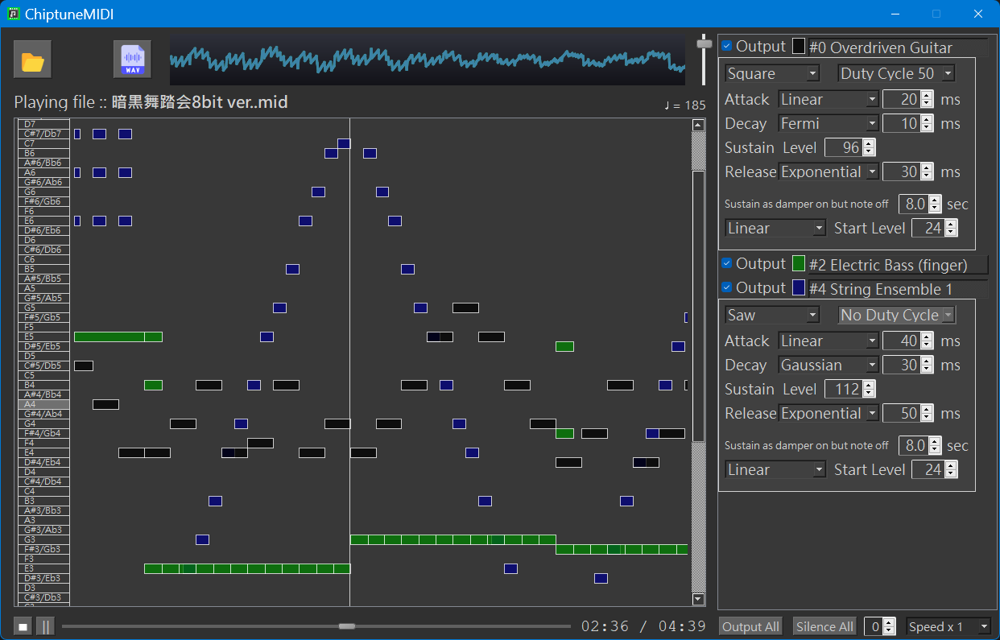

# ChiptuneMIDI

## Description
<!--- Short introduction of the project. -->
ChiptuneMIDI is built around a portable C99 chiptune engine.  
A Qt application is included as a reference front-end, showcasing real-time playback, instrument controls, and audio export.


## Demo
- [梁靜茹 如果有一天 — ChiptuneMIDI cover](https://www.youtube.com/watch?v=3lz47rfHsxA)  
  *(Generated with ChiptuneMIDI engine — [original song](https://www.youtube.com/watch?v=K3o6SfwZq_w) by 梁靜茹)*

## Features
<!--- Key features. -->

### Engine (Core Library)
- Pure C99, no external dependencies
- Stereo/mono output at configurable sampling rates
- Retro waveforms (square with multiple duty cycles, triangle, saw, noise)
- Customizable ADSR envelopes with various curve types
- Supports common MIDI effects (e.g., vibrato, reverb, chords)
- Tempo control, pitch shift, and playback speed adjustable
- Exports audio samples (8-bit/16-bit) for any backend

### Application (Qt GUI)
- Play MIDI files directly with retro 8-bit sound
- Visual note sequencer (score-like interface)
- Export audio output as `.wav`
- All engine features (waveforms, ADSR, etc.) are configurable via the GUI


## Requirements / Dependencies
<!--- List of software, libraries, or frameworks required. -->

- C++11 compiler
- Qt 5.x (Core, Widgets, Charts, Multimedia; on Windows: WinExtras)
- Qt 6.x (Core, Widgets, Charts, Multimedia)
- CMake ≥ 3.20 (recommended), or QtCreator with qmake

## Installation
<!--- Steps to install and build. -->
You can build ChiptuneMIDI in two ways:

### Option A: CMake (Qt5 or Qt6)
1. Open `qt/CMakeLists.txt` with QtCreator or run CMake manually
2. Select a Qt kit (Qt5 or Qt6)
3. Build and run

### Option B: qmake (Qt5 only)
1. Open `qt/qt5_qmake_project/ChiptuneMIDI.pro` in QtCreator
2. Build and run

## Usage
<!--- Examples of how to run or use the project. -->

- Start the application after building.
- Open a `.mid` file either by:
  - Dragging the file into the window, or
  - Clicking the **Open MIDI File** button and selecting from the file explorer.
- Playback starts automatically.
- To export audio, click the **Save as .wav File** button.

**Note:** A sample MIDI file (`qt/暗黒舞踏会8bit ver..mid`) is included for quick testing.

## Project Structure
<!--- Overview of folders and files. -->
```
ChiptuneMIDI/
├─ (root) # Core engine (C99, no dependencies)
├─ qt/ # Qt GUI application
│ ├─ qt5_qmake_project/ # qmake project (Qt5 only)
│ ├─ QMidi/ # External MIDI library (imported, read-only)
│ └─ icons/ # Application icons
```

## Configuration
<!--- How to configure settings, environment variables, etc. -->
No special configuration is required.  
Open the project in QtCreator and build with either Qt5 or Qt6 — both are supported.


## Roadmap
<!--- Planned future improvements. -->
- [ ] Port the engine to microcontrollers to run as a standalone chiptune player.
- [ ] Open to future extensions and contributions (e.g., new front-ends, extra MIDI features)

## Contributing
<!--- Guidelines for external contributors -->
Contributions are welcome!  
Please fork the repository and submit pull requests.  
For major changes, open an issue first to discuss what you would like to add or modify.  

Make sure your code passes existing builds/tests and follows the coding style:
- Functions use `camelCase`
- Variables use `snake_case`
- Avoid abbreviations


## License
<!--- Type of license and conditions. -->
This project is licensed under the MIT License — see the [LICENSE](https://rem.mit-license.org/) file for details.

## Acknowledgements
<!--- Credits, references, inspirations. -->
- Uses [QMidi](https://github.com/waddlesplash/QMidi) library for MIDI file parsing  
- Inspired by Dragon Guardian's [*暗黒舞踏会 8bit ver.*](https://www.youtube.com/watch?v=RFkPC6qlFmo) — thanks to composer [勇者アーサー](https://x.com/dragonguardiana)